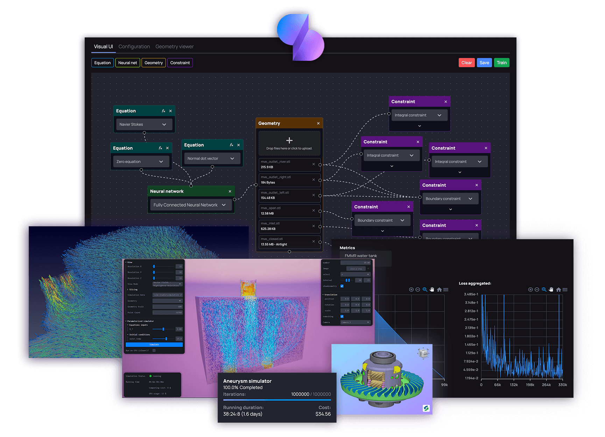

# Introduction
 
Welcome to Siml.ai documentation!

Siml.ai is a software platform for AI-based numerical simulation, providing a set of tools to easily create, 
train and deploy powerful high-performance AI-based physics simulators (also called surrogate models). It automates 
access to powerful GPU-based cloud servers and AI inferencing pipelines.

